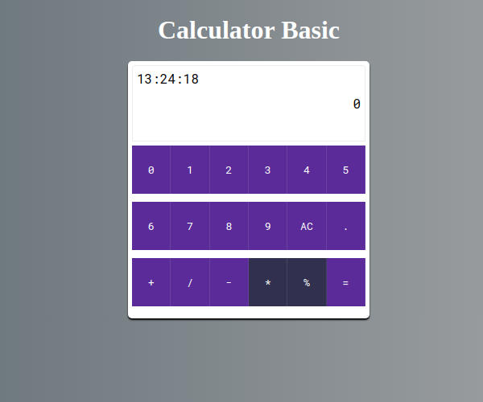

# Calculadora de Operacoes Basicas

Serve Para efetuar operações aritméticas básicas, desde multiplicação ate divisão.

Caso esteja curioso quanto a sua funcionalidade, você pode acessar : <https://app-calculator-basic.herokuapp.com/>
Sinta-se livre para clonar o repositorio e efetuar melhorias.

## Forma de uso em desenvolvimento:

-Efetue o clone do repositorio.

-Acesse os arquivos em sua maquina.

-execute o comando yarn para baixar todas as dependencias.

-Execute o servidor de desenvolvimento com o comando yarn dev e efetue as desejadas alterações no projeto.